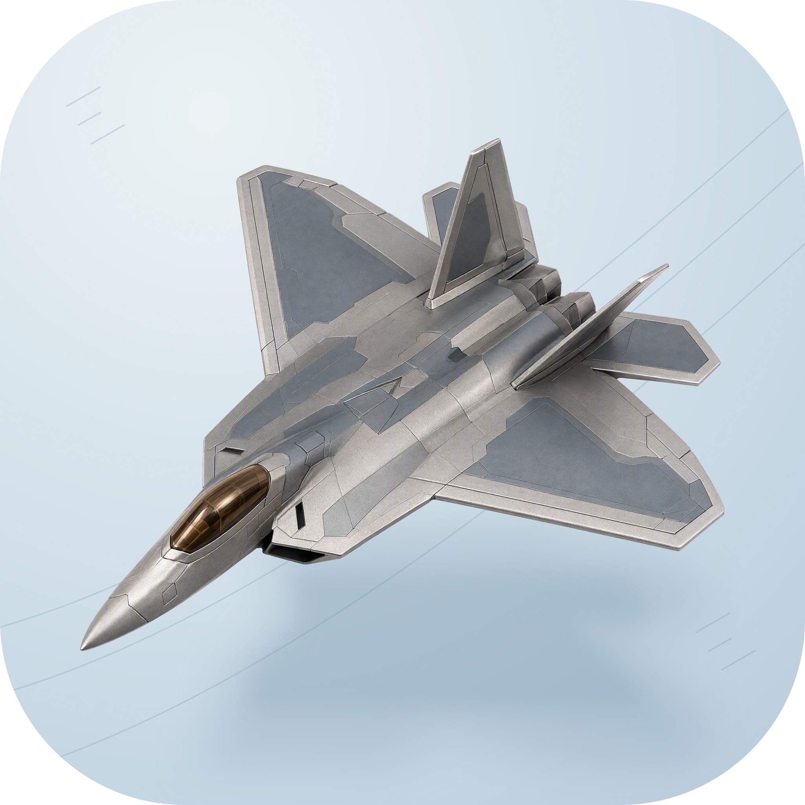
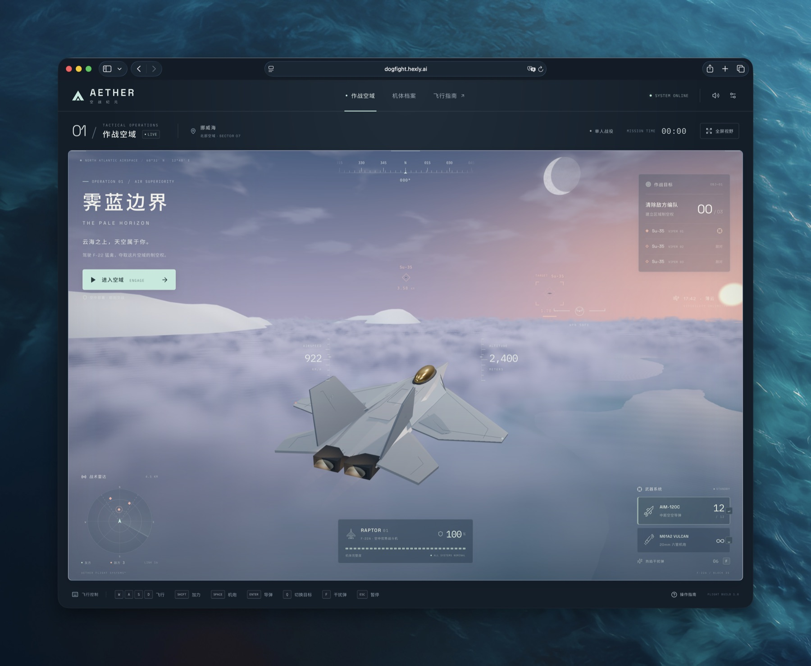

<p align="center">
  
</p>

<h1 align="center">Dogfight</h1>

<p align="center">
  <strong>浏览器里的 3D 空战</strong><br>
  驾驶 F-22 · 对阵 Su-35 · 街机飞行
</p>

<p align="center">
  
  
  
  
  
  
</p>

<p align="center">
  <a href="https://dogfight.hexly.ai"></a>
</p>

---

## 这是什么

Dogfight 是一款可直接游玩的 3D 空战游戏，产品名 **AETHER · 霁蓝边界**。玩家固定驾驶 F-22，对抗三架 Su-35，从空中交战开始，没有起飞或降落阶段。

**核心思路**：街机手感优先于拟真飞行，锁定、导弹、机炮和干扰都围绕一场完整战役设计。

线上：https://dogfight.hexly.ai

## 功能

- **街机空战** — 固定子步长的独立战斗模拟，三架敌机全部击落即胜利
- **武器系统** — AIM-120C 导弹锁定、无限机炮（过热）、热焰干扰
- **程序化世界** — F-22 / Su-35 机体、地形、云层、水面与战斗音效均本地生成
- **多端操作** — 键盘、鼠标、触屏方向键，支持横屏；切走标签页自动暂停

## 操作

| 按键 | 操作 |
| --- | --- |
| W / S、↑ / ↓ | 上仰 / 俯冲 |
| A / D、← / → | 左转 / 右转 |
| Shift | 按住加力 |
| C | 按住减速 |
| Space | 按住发射机炮 |
| Enter | 发射导弹 |
| Q | 切换目标 |
| F | 释放热焰干扰 |
| Esc / P | 暂停 / 继续 |

目标在前方 21° 锥角与 3.6 km 内持续约 1.1 秒即可锁定。每架敌机需要两枚导弹；1.7 km 内机炮提供轻度瞄准辅助。机体损伤超限或撞击地形则任务失败。

也可点击敌机标记 / 目标列表选择目标，点击武器卡发射导弹。设置中可启用鼠标操纵、反转俯仰和调整渲染质量。

## 项目结构

```text
src/
  App.tsx                 # 界面、设置、暂停与战役流程
  main.tsx                # 入口
  styles.css              # HUD 与响应式布局
  game/
    simulation.ts         # 飞行、制导、武器、胜负
    engine.ts             # 渲染循环与输入
    aircraft.ts           # F-22 / Su-35 程序化机体
    world.ts              # 地形、水面
    clouds.ts             # 云层
    audio.ts              # Web Audio 合成音效
    types.ts              # 输入与战斗状态
scripts/
  browser-smoke.mjs       # 真实键盘走完一场战役
```

## 技术栈

| 层 | 技术 |
| --- | --- |
| 语言 | [TypeScript](https://www.typescriptlang.org/) |
| 界面 | [React 19](https://react.dev/) |
| 渲染 | [Three.js](https://threejs.org/) |
| 构建 | [Vite 6](https://vite.dev/) |
| 发布 | [Cloudflare Workers](https://developers.cloudflare.com/workers/) 静态资源 |

需要支持 WebGL 2 的现代浏览器。资源不依赖外部 3D 模型服务。最高得分保存在当前浏览器本地。

## 开发

```bash
npm install
npm run dev       # 本地开发，点击「进入空域」
npm run build     # TypeScript 检查与生产构建
npm test          # 飞行、制导、武器、胜负与重置
npm run preview
```

开发服务器启动后可运行 `npm run test:browser`，用真实键盘自动完成完整战役。脚本优先使用 macOS 上的 Google Chrome；其他环境先运行 `npx playwright install chromium`。截图写入 `test-results/`。

```bash
npm run build
wrangler deploy --no-autoconfig
```

Worker 名称为 `dogfight`，自定义域名在 `wrangler.jsonc`。备用地址：https://dogfight.nocoo.workers.dev

## 测试

| 层 | 内容 | 触发时机 |
| --- | --- | --- |
| 单元 | 飞行、锁定、导弹、干扰、机炮过热、胜负、地形撞击 | `npm test` |
| 浏览器 | 键盘走完一场战役，校验桌面 / 触屏 / 横屏 | `npm run test:browser` |

## License

[MIT](LICENSE) © 2026

Logo assets and usage: [guide](docs/01-logo-usage.md) · [identity study](https://hexly.ai/logos/dogfight).
